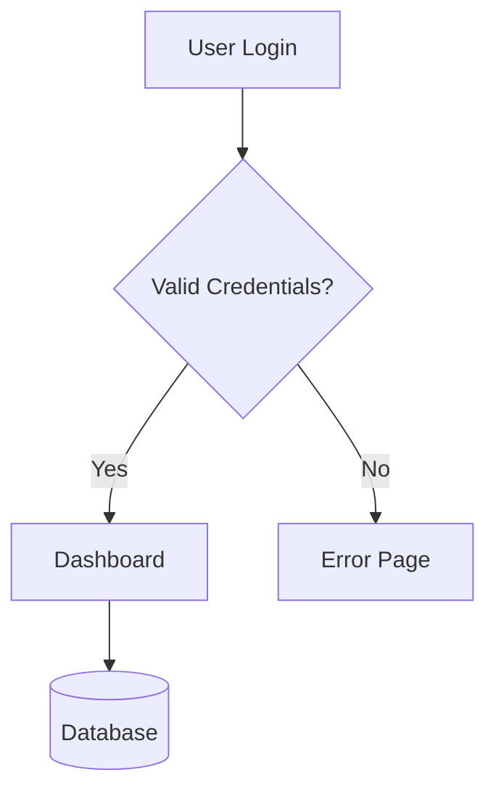

# DiagramFlow - Requirements Document

**Project Name**: DiagramFlow
**Tagline**: Build, Simulate, Visualize

## Project Vision

Create an interactive, VCS-friendly flow diagram tool tailored for software projects, enabling teams to visualize and document system architectures, data flows, process workflows, and component relationships with rich metadata and seamless collaboration.

DiagramFlow goes beyond static diagrams by allowing users to define conditional logic, create example cases with real data, and simulate how data flows through systems step-by-step.

## 1. Node Management

### 1.1 Node Creation & Structure
- **Easy Creation**: Users can create nodes via UI (double-click canvas, toolbar button, or keyboard shortcut)
- **Node Properties**:
  - `id`: Unique identifier (auto-generated UUID or custom)
  - `name`: Display name (required, max 100 chars)
  - `shortDescription`: Brief summary (optional, max 200 chars, shown on hover)
  - `detailedDescription`: Full description (optional, markdown support, shown in side panel)
  - `icon`: Visual identifier (Lucide icon name or custom SVG/emoji)
  - `type`: Node category (see Node Types section)
  - `position`: { x, y } coordinates
  - `metadata`: Extensible key-value object supporting:
    - `dateAdded`: ISO timestamp (auto-generated)
    - `dateModified`: ISO timestamp (auto-updated)
    - `author`: Creator name/email
    - `tags`: Array of strings for categorization
    - `links`: Array of { url, label } for external references
    - `status`: e.g., "planned", "in-progress", "deployed", "deprecated"
    - `version`: Version string
    - `owner`: Team or individual responsible
    - `criticality`: e.g., "low", "medium", "high", "critical"
    - Custom properties: Any additional key-value pairs

### 1.2 Node Types
Predefined node types with distinct visual styling:
- **Service/Component**: Application services, microservices, modules
- **Database**: SQL, NoSQL, cache, data stores
- **External System**: Third-party APIs, external services
- **Client**: Web, mobile, desktop applications
- **Infrastructure**: Load balancers, queues, CDNs
- **Event**: Events, messages, notifications
- **Decision/Conditional**: Conditional logic, gateways, routing decisions
- **Process**: Business processes, workflows
- **Generic**: Fallback for undefined types

Each type should have:
- Default icon
- Color scheme
- Border style
- Size presets (with support for custom sizing)

### 1.3 Conditional Nodes (Decision Points)
Special support for nodes with branching logic:
- **Multiple Outputs**: Support 2+ outgoing connections with distinct conditions
- **Condition Definition**: Each outgoing edge has an associated condition:
  - `condition`: Expression or rule (e.g., "age > 18", "status == 'active'")
  - `label`: Human-readable description of the condition
  - `priority`: Order of evaluation (for if-else-if logic)
- **Visual Indicators**:
  - Diamond shape for decision nodes
  - Color-coded edges (green for true/primary, red for false/fallback)
  - Condition labels visible on edges
- **Logic Types**:
  - **If-Else**: Binary decision (2 outputs)
  - **Switch/Case**: Multiple conditions (3+ outputs)
  - **Guard**: Conditional pass-through (proceeds only if condition met)
  - **Default/Fallback**: Catch-all path when no conditions match

### 1.4 Node Operations
- **Create**: Add new node at cursor or center
- **Read**: View all properties in detail panel
- **Update**: Inline name editing, detail panel for other properties
- **Delete**: Remove node and all connected edges (with confirmation)
- **Duplicate**: Copy node with all properties except id
- **Select**: Single-select (click), multi-select (Ctrl+click, drag selection box)
- **Group**: Create logical groups/clusters with visual boundaries

## 2. Connection Management

### 2.1 Edge Creation & Structure
- **Edge Properties**:
  - `id`: Unique identifier
  - `source`: Source node id
  - `target`: Target node id
  - `label`: Connection description (optional, shown on edge)
  - `type`: Edge style (straight, smoothstep, bezier, step)
  - `animated`: Boolean for flowing dots animation
  - `bidirectional`: Boolean for two-way flow
  - `style`: Object for custom styling (color, width, dash pattern)
  - `metadata`: Extensible properties:
    - `protocol`: e.g., "HTTP", "gRPC", "Kafka", "WebSocket"
    - `dataFlow`: Description of what flows through connection
    - `latency`: Expected latency
    - `throughput`: Expected throughput/volume
    - `security`: e.g., "TLS", "mTLS", "API Key"

### 2.2 Connection Features
- **Directional Flow**:
  - Arrows indicate direction
  - Animated dots flow in specified direction
  - Support for bidirectional connections (arrows on both ends)
- **Visual Styles**:
  - Solid lines: Synchronous/primary connections
  - Dashed lines: Asynchronous/optional connections
  - Dotted lines: Conditional/fallback connections
  - Color coding: Success (green), error (red), neutral (gray)
- **Interactive Labels**: Show protocol, data type, or relationship on hover
- **Connection Validation**: Prevent invalid connections based on rules (e.g., Database can't connect to Client directly)

### 2.3 Edge Operations
- **Create**: Drag from source handle to target handle
- **Update**: Click edge to edit label/properties in panel
- **Delete**: Select edge and press Delete key
- **Reroute**: Drag edge to different source/target
- **Split**: Insert node in middle of existing connection

## 3. Canvas & Interaction

### 3.1 Canvas Controls
- **Pan**: Drag canvas with mouse/trackpad, or space+drag
- **Zoom**: Scroll wheel, pinch gesture, or zoom controls (+/- buttons)
- **Fit View**: Auto-zoom to fit all nodes in viewport
- **Mini-map**: Overview of entire diagram with viewport indicator
- **Background**: Grid (dots or lines) or plain

### 3.2 Drag & Drop
- **Node Movement**:
  - Single node drag: Move one node
  - Multi-node drag: Move all selected nodes together
  - Smart snapping: Align to grid or other nodes
  - Connection preservation: Edges automatically adjust during movement
- **Canvas Organization**:
  - Auto-layout algorithms: Hierarchical, force-directed, circular
  - Manual alignment tools: Distribute horizontally/vertically, align left/right/top/bottom
  - Z-index control: Bring to front, send to back

### 3.3 Search & Filter
- **Search**:
  - Search by node name, description, tags, metadata
  - Highlight matching nodes
  - Jump to search results
- **Filter**:
  - Filter by node type, status, owner, tags
  - Filter by date range (created/modified)
  - Hide/show filtered nodes
  - Isolate paths: Show only nodes connected to selected node

## 4. Information Display

### 4.1 Progressive Disclosure
- **Minimal View** (default):
  - Node icon and name
  - Connection arrows
- **Hover View**:
  - Short description tooltip
  - Edge labels
  - Connection metadata preview
- **Detail View** (on click):
  - Side panel with full properties
  - Detailed description (markdown rendered)
  - All metadata fields
  - Edit capabilities
  - Related nodes/connections
  - History/audit log (who modified, when)

### 4.2 Visual Hierarchy
- **Node Size**: Reflect importance or complexity
- **Color Coding**: Consistent scheme for types and statuses
- **Badges**: Show status indicators, notification counts
- **Clustering**: Visual grouping of related nodes

## 5. State Persistence & Sessions

### 5.1 Diagram State Persistence
All diagram state must be persisted to maintain continuity across sessions:

**Persisted Data**:
- **Node State**:
  - All node properties (id, name, descriptions, metadata)
  - Node positions (x, y coordinates)
  - Node dimensions (width, height if customized)
  - Visual state (collapsed/expanded, custom colors)
- **Edge State**:
  - All edge properties (source, target, labels, conditions)
  - Edge routing (custom bend points if manually adjusted)
  - Visual customizations
- **Canvas State**:
  - Zoom level
  - Pan position (center coordinates)
  - Viewport bounds
- **UI State**:
  - Selected nodes/edges
  - Collapsed groups
  - Active filters
  - Open panels (detail panel, property editor)

**Storage Mechanism**:
- **Primary**: Local file system (JSON/YAML files)
- **Browser Storage**:
  - localStorage: Auto-save drafts, user preferences, recent diagrams
  - sessionStorage: Temporary clipboard, undo/redo history
  - IndexedDB: Large diagrams (>5MB), offline cache

### 5.2 Session Management (Client-Side)
Since the application is **client-side only**, session management uses browser storage:

**Cookie-Based Sessions**:
- **Session Cookie** (`diagram_session_id`):
  - Stores unique session identifier
  - HttpOnly: false (accessible to client JS)
  - SameSite: Lax
  - Expires: 7 days (configurable)
- **Purpose**:
  - Track user's active diagrams
  - Restore last opened diagram on return
  - Maintain user preferences across browser sessions
  - Support "Open Recent" functionality

**Session Data Structure** (stored in localStorage):
```json
{
  "sessionId": "uuid-v4",
  "createdAt": "2024-01-15T10:00:00Z",
  "lastAccess": "2024-01-20T15:30:00Z",
  "activeDiagramId": "diagram-uuid",
  "recentDiagrams": [
    {
      "id": "diagram-uuid",
      "name": "System Architecture",
      "lastModified": "2024-01-20T15:30:00Z",
      "thumbnail": "base64-encoded-preview"
    }
  ],
  "preferences": {
    "theme": "dark",
    "autoSaveInterval": 30000,
    "defaultNodeType": "service"
  }
}
```

**Multi-Tab Synchronization**:
- Use `storage` event listener to sync state across browser tabs
- Detect concurrent edits and show warning
- Last-write-wins conflict resolution with notification

**Privacy Considerations**:
- All data stays in browser (no server uploads)
- Clear session data on explicit user logout
- Respect "Do Not Track" for analytics

## 6. Example Cases & Flow Simulation

### 6.1 Example Case Definition
Users can define concrete examples that demonstrate specific paths through the diagram:

**Use Cases**:
- **ETL Pipeline**: Show how specific data (e.g., "CustomerRecord with age=25") flows through transformations and conditionals
- **Request Flow**: Trace how a specific API request moves through services
- **Error Scenarios**: Demonstrate error handling paths
- **Edge Cases**: Visualize boundary conditions and their routing

**Example Case Structure**:
```yaml
exampleCases:
  - id: "case-1"
    name: "New Adult Customer Registration"
    description: "Customer with age > 18 registering for first time"
    input:
      nodeId: "input-node-id"
      data:
        age: 25
        accountStatus: "new"
        country: "US"
    expectedPath: ["node-1", "node-2", "node-5", "node-8"]
    highlights:
      - edgeId: "edge-1-2"
        reason: "Age > 18, takes adult path"
      - edgeId: "edge-2-5"
        reason: "New account, skip verification"
```

### 6.2 Flow Simulation & Visualization
Interactive simulation of example cases through the diagram:

**Simulation Controls**:
- **Play**: Auto-advance through the path with animation
- **Step Forward/Back**: Manual step-through
- **Speed Control**: Adjust animation speed (0.5x to 3x)
- **Pause/Resume**: Pause at any node to inspect state

**Visual Feedback During Simulation**:
- **Active Node**: Highlighted with pulsing border and distinct color
- **Active Edge**: Animated flow with brighter color
- **Traversed Path**: Nodes/edges already visited shown with trail effect
- **Upcoming Path**: Dimmed preview of remaining path
- **Data Inspector**: Floating panel showing current data state at active node

**Conditional Evaluation Display**:
- When simulation reaches a conditional node:
  - Show all outgoing conditions
  - Highlight which condition evaluated to true
  - Display evaluation result (e.g., "age > 18 → true")
  - Animate selection of the chosen path
  - Show why other paths were not taken (grayed out with "false" badge)

**Example Case Manager UI**:
- **Case Library**: List of saved example cases
- **Case Editor**: Define input data, expected path
- **Case Runner**: Execute simulation
- **Comparison View**: Run multiple cases side-by-side
- **Test Results**: Verify actual path matches expected path (for validation)

### 6.3 Interactive Data Transformation
Show how data transforms as it flows through nodes:

**Data State Tracking**:
- Each node in the path can transform the data
- Display input and output data at each node
- Show diff between input and output
- Support for:
  - Field mapping (input.name → output.customerName)
  - Filtering (remove fields)
  - Enrichment (add fields from lookup)
  - Validation (highlight errors)

**Use Case**: ETL Pipeline Example
```
Input Node: { rawData: "john,25,US" }
  ↓
Parse Node: { name: "john", age: 25, country: "US" }
  ↓
Validate Node: ✓ age > 0, ✓ country in allowed list
  ↓
Transform Node: { firstName: "John", age: 25, countryCode: "US", region: "North America" }
  ↓
Decision Node: age >= 18 → [true] → adult path
  ↓
Output Node: Write to customers table
```

## 7. Export & Persistence

### 7.1 File Format (VCS-Friendly)
- **Primary Format**: JSON or YAML
- **Structure**:
```yaml
version: "1.0"
metadata:
  name: "System Architecture"
  description: "Main system diagram"
  created: "2024-01-15T10:00:00Z"
  modified: "2024-01-20T15:30:00Z"
  authors: ["john@example.com"]

nodes:
  - id: "node-1"
    name: "API Gateway"
    type: "service"
    icon: "server"
    position: { x: 100, y: 200 }
    shortDescription: "Main entry point"
    detailedDescription: |
      # API Gateway
      Handles all incoming requests...
    metadata:
      status: "deployed"
      owner: "Platform Team"
      version: "2.3.1"
      tags: ["core", "infrastructure"]
      links:
        - url: "https://docs.example.com/api-gateway"
          label: "Documentation"

edges:
  - id: "edge-1"
    source: "node-1"
    target: "node-2"
    label: "HTTP/JSON"
    animated: true
    type: "smoothstep"
    metadata:
      protocol: "REST"
      security: "OAuth2"
  - id: "edge-2"
    source: "node-2"
    target: "node-3"
    label: "if age > 18"
    condition: "input.age > 18"
    priority: 1
  - id: "edge-3"
    source: "node-2"
    target: "node-4"
    label: "else (minor)"
    condition: "input.age <= 18"
    priority: 2
    style:
      stroke: "#ef4444"

exampleCases:
  - id: "case-1"
    name: "Adult User Flow"
    input:
      nodeId: "node-1"
      data: { age: 25, name: "John" }
    expectedPath: ["node-1", "node-2", "node-3"]

layout:
  zoom: 1.0
  center: { x: 500, y: 400 }

canvasState:
  background: "dots"
  snapToGrid: true
  gridSize: 20
```

### 7.2 Export Formats
- **Interactive**:
  - Standalone HTML (self-contained with all assets)
  - Embedded component (for documentation sites)
  - Web link (hosted version with sharing link)
- **Static**:
  - PNG/SVG: High-resolution image export
  - PDF: Print-friendly format with metadata appendix
  - Mermaid: For compatibility with documentation tools
- **Data**:
  - JSON/YAML: Raw data for backup or processing
  - CSV: Tabular export of nodes and connections
  - GraphML/DOT: For import into other graph tools

### 7.3 Import
- **Sources**:
  - JSON/YAML files (native format)
  - Mermaid diagrams (automatic conversion - see detailed section below)
  - Architecture as Code (e.g., Terraform, Kubernetes manifests)
  - CSV (for bulk node creation)

### 7.4 Mermaid Migration Tool
**Critical Feature**: Seamless migration from Mermaid to DiagramFlow format

Many teams already use Mermaid for documentation. A robust migration tool is essential for adoption.

#### Supported Mermaid Syntax

**Diagram Types**:
- `graph TD` / `graph LR` - Flow diagrams (top-down, left-right)
- `flowchart TD` / `flowchart LR` - Modern flowchart syntax
- Future: `sequenceDiagram`, `classDiagram` (Phase 2 of migration tool)

**Node Syntax**:
```mermaid
A[Rectangle]           → type: "service"
B(Rounded)             → type: "service"
C([Stadium])           → type: "process"
D[[Subroutine]]        → type: "process"
E[(Database)]          → type: "database"
F((Circle))            → type: "client"
G>Asymmetric]          → type: "generic"
H{Decision}            → type: "decision"
I{{Hexagon}}           → type: "process"
J[/Parallelogram/]     → type: "generic"
K[\Parallelogram\]     → type: "generic"
L[/Trapezoid\]         → type: "generic"
M[\Trapezoid/]         → type: "generic"
```

**Edge Syntax**:
```mermaid
A --> B                → animated: true, type: "smoothstep"
A --- B                → animated: false (undirected)
A -.-> B               → animated: true, style: dashed
A ==> B                → animated: true, style: thick
A -- label --> B       → label: "label"
A -->|label| B         → label: "label"
A -.label.-> B         → label: "label", style: dashed
```

**Subgraphs (Groups)**:
```mermaid
subgraph Title
  A --> B
end
```
→ Convert to grouped nodes with visual boundary

#### Conversion Logic

**Node Mapping**:
1. **Parse Mermaid syntax** using Mermaid parser or regex
2. **Extract node ID and label** from each node declaration
3. **Map shape to node type**:
   - `[` `]` → "service"
   - `[(` `)]` → "database"
   - `{` `}` → "decision"
   - `((` `))` → "client"
   - Default → "generic"
4. **Assign default icon** based on type
5. **Generate position** using auto-layout algorithm (hierarchical or force-directed)
6. **Create metadata**:
   - `dateAdded`: Current timestamp
   - `author`: "Imported from Mermaid"
   - `status`: "imported"
   - `tags`: ["imported", "needs-review"]

**Edge Mapping**:
1. **Parse edge syntax** (source, target, label, style)
2. **Map edge style**:
   - `-->` → `animated: true, type: "smoothstep"`
   - `---` → `animated: false`
   - `.->` → `animated: true, style: { strokeDasharray: "5,5" }`
   - `==>` → `animated: true, style: { strokeWidth: 3 }`
3. **Extract labels** from `-- label -->` or `-->|label|` syntax
4. **Detect conditionals** from labels:
   - If label contains "if", "else", "when", create conditional edge
   - Extract condition from label (e.g., "if age > 18" → `condition: "age > 18"`)

**Layout Strategy**:
- Use hierarchical layout for `graph TD` (top-down)
- Use horizontal layout for `graph LR` (left-right)
- Apply spacing: 150px horizontal, 100px vertical between nodes
- Respect subgraph boundaries (group nodes visually)

#### Migration Tool UI

**Input Methods**:
1. **Paste Mermaid Code**: Text area to paste Mermaid syntax
2. **Upload .mmd File**: File picker for Mermaid files
3. **URL Import**: Fetch from URL (e.g., GitHub raw URL)

**Conversion Preview**:
- Show side-by-side comparison:
  - Left: Original Mermaid diagram (rendered)
  - Right: DiagramFlow preview
- Highlight differences or unmapped elements
- Show warnings for unsupported syntax

**Post-Conversion Options**:
1. **Auto-enhance**: Apply DiagramFlow features
   - Suggest icons based on node labels (e.g., "Database" → database icon)
   - Infer node types from labels (e.g., "API" → service, "MySQL" → database)
   - Generate placeholder metadata
2. **Manual Review Mode**: Flag nodes for user review
   - Nodes with generic type highlighted
   - Edges with auto-detected conditions marked for verification
3. **Import & Edit**: Load converted diagram for further editing

#### Conversion Quality

**High-Fidelity Conversion** (Structure preserved):
- ✅ All nodes imported with correct connections
- ✅ Labels preserved
- ✅ Layout approximates original (top-down or left-right)

**Enhanced Conversion** (DiagramFlow features added):
- ✅ Decision nodes converted to conditional nodes
- ✅ Icons suggested based on labels
- ✅ Metadata placeholders created
- ⚠️ User review required for:
  - Auto-detected node types
  - Auto-extracted conditions from labels
  - Generated positions (may need adjustment)

**Unsupported Elements** (with warnings):
- ⚠️ Mermaid-specific styling (themes, CSS classes)
- ⚠️ Click events and links (convert to metadata links if possible)
- ⚠️ Comments (preserved as node metadata notes)

#### Example Conversion

**Input (Mermaid)**:


**Output (DiagramFlow JSON)**:
```json
{
  "nodes": [
    {
      "id": "A",
      "type": "client",
      "position": { "x": 250, "y": 0 },
      "data": {
        "label": "User Login",
        "icon": "user",
        "metadata": {
          "status": "imported",
          "tags": ["imported"],
          "dateAdded": "2024-12-26T..."
        }
      }
    },
    {
      "id": "B",
      "type": "decision",
      "position": { "x": 250, "y": 150 },
      "data": {
        "label": "Valid Credentials?",
        "icon": "git-branch",
        "metadata": { "status": "imported", "tags": ["imported", "needs-review"] }
      }
    },
    {
      "id": "C",
      "type": "service",
      "position": { "x": 100, "y": 300 },
      "data": {
        "label": "Dashboard",
        "icon": "layout-dashboard",
        "metadata": { "status": "imported", "tags": ["imported"] }
      }
    },
    {
      "id": "D",
      "type": "service",
      "position": { "x": 400, "y": 300 },
      "data": {
        "label": "Error Page",
        "icon": "alert-circle",
        "metadata": { "status": "imported", "tags": ["imported"] }
      }
    },
    {
      "id": "E",
      "type": "database",
      "position": { "x": 100, "y": 450 },
      "data": {
        "label": "Database",
        "icon": "database",
        "metadata": { "status": "imported", "tags": ["imported"] }
      }
    }
  ],
  "edges": [
    { "id": "e1", "source": "A", "target": "B", "animated": true },
    {
      "id": "e2",
      "source": "B",
      "target": "C",
      "label": "Yes",
      "animated": true,
      "data": {
        "condition": "credentials.valid === true",
        "conditionType": "true"
      },
      "style": { "stroke": "#10b981" }
    },
    {
      "id": "e3",
      "source": "B",
      "target": "D",
      "label": "No",
      "animated": true,
      "data": {
        "condition": "credentials.valid === false",
        "conditionType": "false"
      },
      "style": { "stroke": "#ef4444" }
    },
    { "id": "e4", "source": "C", "target": "E", "animated": true }
  ]
}
```

#### Implementation Notes

**Parser Options**:
1. **Use Mermaid Library**: Import `mermaid` package, parse to AST
2. **Regex Parser**: Lightweight, custom regex-based parser
3. **Hybrid**: Mermaid parser for validation, custom logic for conversion

**Auto-Layout Algorithm**:
- Use Dagre layout (hierarchical)
- Or ELK (Eclipse Layout Kernel) for complex graphs
- Fallback: Simple grid layout

**User Feedback**:
- Show conversion progress (parsing, mapping, layout)
- Display warnings for unsupported elements
- Allow re-run conversion with different options

#### Success Criteria

A successful Mermaid migration tool will:
1. ✅ Convert 95%+ of common Mermaid flow diagrams without errors
2. ✅ Preserve all nodes, edges, and labels accurately
3. ✅ Auto-detect decision nodes and create conditional edges
4. ✅ Generate reasonable layout (may require minor manual adjustment)
5. ✅ Provide clear warnings for unsupported Mermaid features
6. ✅ Complete conversion in <2 seconds for diagrams with <50 nodes
7. ✅ Allow users to immediately edit and enhance the imported diagram

## 8. Version Control Integration

### 8.1 VCS Best Practices
- **File Organization**:
  - One diagram per file
  - Separate directory for diagrams (e.g., `/diagrams`, `/docs/architecture`)
  - Naming convention: `kebab-case.diagram.yaml`
- **Diff-Friendly**:
  - Alphabetically sorted fields where possible
  - Stable node IDs (don't auto-regenerate on save)
  - Consistent formatting/indentation
  - Comments preserved in YAML format
- **Merge Friendly**:
  - Avoid large monolithic files
  - Position changes don't conflict with property changes
  - Clear conflict markers for manual resolution

### 8.2 Change Tracking
- **Built-in History**:
  - Track who modified what and when
  - Show change log in detail panel
  - Highlight recently modified nodes
- **Git Integration** (optional):
  - Commit from UI
  - View git blame for nodes
  - Diff visualization between versions

## 9. Collaboration Features

### 9.1 Multi-User Support
- **Concurrent Editing**:
  - Real-time collaboration (WebSocket-based)
  - User presence indicators
  - Cursor tracking
  - Optimistic updates with conflict resolution
- **Comments & Annotations**:
  - Add comments to nodes/edges
  - Thread discussions
  - Mention users (@username)
  - Resolve/archive comments

### 9.2 Permissions
- **Roles**:
  - Viewer: Read-only access
  - Editor: Create/update nodes and edges
  - Admin: Manage diagram settings, permissions
- **Granular Control**:
  - Lock individual nodes to prevent edits
  - Approve changes before merge (review workflow)

## 10. Additional Features for Software Projects

### 10.1 Documentation Integration
- **Inline Documentation**:
  - Link nodes to confluence/wiki pages
  - Embed API documentation
  - Show code snippets in detail panel
- **Auto-Generate Docs**:
  - Create markdown documentation from diagram
  - Generate API catalog from service nodes
  - Export architecture decision records (ADRs)

### 10.2 Metrics & Monitoring
- **Live Data Integration**:
  - Show real-time status (green/yellow/red indicators)
  - Display metrics (CPU, memory, request rate) in node badges
  - Alert indicators for incidents
- **Data Sources**:
  - Prometheus/Grafana
  - Cloud provider APIs (AWS, GCP, Azure)
  - APM tools (Datadog, New Relic)

### 10.3 Analysis Tools
- **Dependency Analysis**:
  - Find all dependencies of a node
  - Identify circular dependencies
  - Calculate dependency depth/complexity
  - Impact analysis: What breaks if this node fails?
- **Path Finding**:
  - Trace data flow from source to destination
  - Find shortest path between nodes
  - Identify bottlenecks
- **Reports**:
  - Generate dependency matrix
  - Service inventory report
  - Compliance reports (which services handle PII, payment data)

### 10.4 Templates & Patterns

#### Default Template: Pet Clinic Application
On first launch, users are greeted with a fully-functional template diagram:

**Architecture**: Classic 3-tier web application
**Components**:
1. **Frontend**: Angular 18 application
   - Node properties:
     - Type: `client`
     - Icon: `angular` logo
     - Tech stack: TypeScript, Angular 18, RxJS
     - Features: User authentication, CRUD operations UI
     - Routes: `/login`, `/pets`, `/owners`, `/vets`

2. **Backend**: Spring Boot 3.2 (Java 21)
   - Node properties:
     - Type: `service`
     - Icon: `spring` logo
     - Tech stack: Java 21, Spring Boot 3.2, Spring Data JPA, Spring Security
     - Endpoints:
       - `POST /api/auth/login`
       - `GET /api/pets`, `POST /api/pets`, `PUT /api/pets/{id}`, `DELETE /api/pets/{id}`
       - `GET /api/owners`, etc.
     - Features: JWT authentication, RESTful API, validation

3. **Database**: MySQL 8.0
   - Node properties:
     - Type: `database`
     - Icon: `mysql` logo
     - Tables: `users`, `pets`, `owners`, `vets`, `visits`
     - Features: Foreign key constraints, indexes

**Connections**:
- Angular → Spring Boot: `HTTP/REST (JWT)`
- Spring Boot → MySQL: `JDBC (MySQL Connector)`

**Conditional Logic Example**:
- **Authentication Decision Node**:
  - Input: Login request with credentials
  - Condition 1: `credentials.valid == true` → Proceed to Dashboard
  - Condition 2: `credentials.valid == false` → Return 401 error

**Example Cases** (included in template):
1. **User Login Flow**:
   - Input: `{ username: "admin", password: "admin123" }`
   - Path: Angular → Spring Boot (AuthController) → [Check credentials] → MySQL → [Valid] → Return JWT → Angular stores token

2. **Create New Pet**:
   - Input: `{ name: "Fluffy", type: "cat", ownerId: 42 }`
   - Path: Angular → Spring Boot (PetController) → [Validate JWT] → [Validate owner exists] → MySQL INSERT → Return pet with ID

3. **Invalid Owner Error**:
   - Input: `{ name: "Spot", type: "dog", ownerId: 999 }`
   - Path: Angular → Spring Boot → [Validate owner] → MySQL query returns null → Return 404 error → Angular shows error message

**Template Benefits**:
- Immediately interactive and explorable
- Demonstrates all major features (nodes, edges, conditionals, example cases)
- Realistic architecture that developers recognize
- Can be cleared or modified to start new diagrams

#### Additional Pre-built Templates
- Microservices architecture (with service mesh)
- Event-driven architecture (Kafka-based)
- CI/CD pipeline (GitHub Actions → Docker → Kubernetes)
- ETL data pipeline (with conditional transformations)
- API gateway pattern (Kong/NGINX)
- Serverless architecture (AWS Lambda)

#### Custom Templates
- Save any diagram as a reusable template
- Export templates as JSON for sharing
- Import community templates
- Template marketplace (future consideration)

### 10.5 Validation & Linting
- **Diagram Rules**:
  - Required fields enforcement
  - Naming conventions
  - Orphan node detection (no connections)
  - Dead-end detection (no outgoing connections)
- **Custom Rules**:
  - Define organizational standards
  - Security rules (e.g., "all external connections must use TLS")
  - Architecture rules (e.g., "services can't directly connect to databases")

## 11. Technical Requirements

### 11.1 Architecture: Client-Side Only
**Critical Constraint**: The application must be **100% client-side** with no backend server.

**Implications**:
- **No Server**: All logic runs in the browser (JavaScript/TypeScript)
- **No Database**: Use browser storage (localStorage, IndexedDB)
- **No Server-Side Sessions**: Session management via cookies + browser storage
- **No Server-Side Auth**: Authentication (if needed) via OAuth/OIDC to third-party providers
- **File Operations**:
  - Save: Download JSON/YAML files to user's computer
  - Load: File input or drag-and-drop to read files
  - Alternative: Store diagrams in browser's IndexedDB with export/import options

**Deployment**:
- Static hosting (GitHub Pages, Netlify, Vercel, S3 + CloudFront)
- Single HTML file + bundled JS/CSS (can be served from any web server)
- No build-time server requirements

**Benefits**:
- Zero infrastructure costs
- No server maintenance
- Works offline (with Service Worker)
- Complete data privacy (data never leaves user's browser)
- Fast, instant load times
- Easy self-hosting

**Trade-offs**:
- No real-time collaboration (unless using P2P or third-party sync service)
- Limited by browser storage quotas
- Must handle large diagrams efficiently in-browser

### 11.2 Performance
- **Scalability**:
  - Support 500+ nodes without performance degradation
  - Lazy rendering for large diagrams
  - Virtual scrolling for node lists
- **Optimization**:
  - Debounced auto-save
  - Efficient re-rendering (React.memo, useMemo)
  - Web Workers for heavy computations (layout algorithms)

### 11.3 Accessibility
- **Keyboard Navigation**:
  - Tab through nodes
  - Arrow keys to navigate connections
  - Keyboard shortcuts for common actions
- **Screen Reader Support**:
  - Semantic HTML
  - ARIA labels
  - Text alternatives for visual elements
- **Visual Accessibility**:
  - High contrast mode
  - Colorblind-friendly palettes
  - Adjustable font sizes

### 11.4 Browser Compatibility
- **Modern Browsers**: Chrome, Firefox, Safari, Edge (last 2 versions)
- **Responsive Design**: Desktop (primary), tablet (view/light edit), mobile (view only)

### 11.5 Undo/Redo
- **History Stack**:
  - Unlimited undo/redo
  - Persist history across sessions (localStorage)
  - Show action descriptions in history panel
- **Operations**:
  - Node create/update/delete
  - Edge create/update/delete
  - Position changes
  - Batch operations (multi-select delete)

## 12. User Experience

### 12.1 Onboarding
- **Getting Started**:
  - Welcome tutorial (interactive walkthrough)
  - Sample diagrams to explore
  - Quick start templates
- **Contextual Help**:
  - Tooltips on UI elements
  - Help panel with searchable documentation
  - Keyboard shortcut cheatsheet

### 12.2 Performance Feedback
- **Loading States**:
  - Progress indicators for long operations
  - Skeleton screens while loading
- **Success/Error Messages**:
  - Toast notifications for actions
  - Inline validation errors
  - Auto-save indicators

### 12.3 Customization
- **User Preferences**:
  - Theme (dark/light)
  - Default node type
  - Auto-save interval
  - Grid snap settings
- **Diagram Settings**:
  - Canvas background
  - Default edge style
  - Layout algorithm preferences

## Success Criteria

A successful implementation will:
1. Allow users to create and maintain complex diagrams (100+ nodes) efficiently
2. Produce VCS-friendly files that merge cleanly in Git
3. Export interactive diagrams that can be shared with stakeholders
4. Provide rich metadata without cluttering the visual interface
5. Support team collaboration through file sharing (no real-time required for v1)
6. Integrate seamlessly into existing documentation workflows
7. Be intuitive enough for new users to create their first diagram in < 5 minutes
8. **Persist all diagram state** (positions, sizes, zoom, selections) automatically
9. **Visualize conditional logic** clearly with support for multiple branching paths
10. **Demonstrate data flow** through example cases that animate through the diagram
11. **Work 100% offline** as a client-side application with no server dependencies
12. **Load instantly** with the Pet Clinic template to demonstrate all capabilities
13. **Convert existing Mermaid diagrams** to DiagramFlow format with 95%+ accuracy

## Out of Scope (Phase 1)

- Real-time multi-user collaboration (WebSocket-based) - use file sharing instead
- Backend server for cloud storage
- Mobile native apps (responsive web UI is sufficient)
- Video/audio annotations
- AI-powered diagram generation from text descriptions (could be added later as client-side feature using browser AI APIs)
- Real-time monitoring dashboards with live metrics (read-only static data can be shown)
- Advanced animation timeline editor (simple play/pause/step simulation is sufficient)
- Diagram versioning/history beyond undo/redo (use Git for versioning)

## Implementation Notes

### Session Management Details
Since we're client-side only:
- **Session Cookie**: Use `js-cookie` library to manage cookies from JavaScript
- **Cookie Structure**:
  ```javascript
  // Set session cookie
  Cookies.set('diagram_session', {
    id: uuid(),
    created: Date.now(),
    lastDiagram: 'pet-clinic-default'
  }, { expires: 7, sameSite: 'lax' });
  ```
- **Multi-Tab Sync**:
  ```javascript
  // Listen for storage changes in other tabs
  window.addEventListener('storage', (e) => {
    if (e.key === 'diagram_state') {
      // Another tab modified the diagram, reload or warn user
    }
  });
  ```

### State Persistence Strategy
- **Auto-save**: Every 30 seconds (debounced) to localStorage
- **Manual save**: Export to JSON file on demand
- **Session restore**: On page load, check for:
  1. Query param: `?diagram=<url-or-id>`
  2. Cookie: Last opened diagram
  3. Default: Load Pet Clinic template
- **Storage Keys**:
  - `diagram_current`: Currently active diagram
  - `diagram_<id>`: Saved diagram by ID
  - `diagram_list`: Index of all saved diagrams
  - `diagram_preferences`: User preferences

### Example Case Execution Engine
- Parse diagram into a graph structure
- Evaluate conditions using a safe expression evaluator (e.g., `expr-eval` library)
- Trace path based on condition results
- Animate each step with delays
- Record execution history for debugging

### Pet Clinic Template Implementation
```javascript
const petClinicTemplate = {
  metadata: {
    name: "Pet Clinic - Spring Boot + Angular",
    description: "Classic 3-tier CRUD application",
    version: "1.0.0"
  },
  nodes: [
    {
      id: "angular-frontend",
      type: "client",
      name: "Angular Frontend",
      position: { x: 100, y: 100 },
      icon: "layout",
      metadata: {
        tech: "Angular 18, TypeScript",
        features: ["User Auth", "Pet Management", "Owner Management"]
      }
    },
    // ... more nodes
  ],
  exampleCases: [
    {
      name: "User Login",
      input: { nodeId: "angular-frontend", data: { username: "admin" } },
      expectedPath: ["angular-frontend", "auth-check", "spring-backend", "mysql-db"]
    }
  ]
};
```
