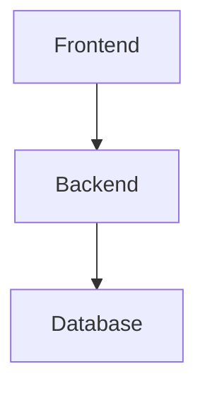

# DiagramFlow User Guide

**Version 1.0** | **Build, Simulate, Visualize**

Welcome to DiagramFlow - an interactive flow diagram tool designed for developers and architects. This guide will help you get the most out of DiagramFlow.

---

## Table of Contents

1. [Getting Started](#getting-started)
2. [Creating Nodes and Edges](#creating-nodes-and-edges)
3. [Node Types and Metadata](#node-types-and-metadata)
4. [Conditional Logic and Branching](#conditional-logic-and-branching)
5. [Example Cases and Simulation](#example-cases-and-simulation)
6. [Saving and Loading Diagrams](#saving-and-loading-diagrams)
7. [Keyboard Shortcuts](#keyboard-shortcuts)
8. [Tips and Tricks](#tips-and-tricks)

---

## Getting Started

### What is DiagramFlow?

DiagramFlow is an interactive, 100% client-side flow diagram tool that lets you:
- **Build** complex system diagrams with rich metadata
- **Simulate** data flow through your system with example cases
- **Visualize** how data moves through nodes with step-by-step execution

### First Launch

When you first open DiagramFlow, you'll see an empty canvas ready for your creativity. The interface consists of:

- **Header**: Contains save/load buttons, search bar, and theme toggle
- **Sidebar**: Left panel with tabs for different tools and features
- **Canvas**: Main drawing area where you create your diagrams
- **Detail Panels**: Right-side panels that appear when you select nodes or edges

### Interface Overview

**Header Bar** (Top):
- **DiagramFlow Logo**: Click to return to home view
- **Save Status**: Shows auto-save status and last saved time
- **Search Bar**: Search and filter nodes in your diagram
- **Undo/Redo**: Navigate through your edit history
- **Save Button**: Save current diagram to browser storage
- **Open Button**: Load a previously saved diagram
- **Import/Export**: Import JSON or Mermaid files, export to JSON
- **Theme Toggle**: Switch between dark and light themes
- **Help Button**: Access tutorials and documentation

**Sidebar** (Left):
- **Nodes Tab**: Drag and drop to create new nodes
- **Example Cases Tab**: Manage test cases for simulation
- **Simulation Tab**: Control playback and visualization
- **Validation Tab**: View warnings and errors in your diagram

**Canvas** (Center):
- Double-click to add a node at any position
- Click and drag to pan the canvas
- Scroll to zoom in/out
- Select nodes and edges to view details

---

## Creating Nodes and Edges

### Creating Nodes

There are three ways to create a node:

1. **Drag and Drop** (Recommended):
   - Open the **Nodes** tab in the sidebar
   - Drag any node type onto the canvas
   - Release to place the node

2. **Double-Click**:
   - Double-click anywhere on the canvas
   - A generic node will be created at that position

3. **Keyboard Shortcut**:
   - Press `N` to create a node (future feature)

### Node Properties

Each node has these basic properties:
- **Label**: The display name (shown on the node)
- **Type**: The node category (Service, Database, Client, etc.)
- **Icon**: Visual identifier from the Lucide icon library
- **Description**: Detailed explanation of the node's purpose

### Editing Nodes

To edit a node:
1. Click on the node to select it
2. The **Node Detail Panel** appears on the right
3. Modify any property:
   - Change the label
   - Select a different icon from 700+ available icons
   - Add description text
   - Update metadata fields

### Creating Edges (Connections)

To connect two nodes:
1. Hover over the source node
2. Click and drag from one of the **connection handles** (small circles)
3. Release on a target node's handle
4. An edge (arrow) is created

### Edge Properties

Click on an edge to view/edit:
- **Label**: Text shown on the edge (e.g., "HTTP", "JDBC")
- **Condition**: Expression that determines if this path is taken
- **Animated**: Toggle animation to show data flow direction
- **Style**: Choose solid, dashed, or dotted lines

### Deleting Nodes and Edges

- Select a node or edge
- Press `Delete` or `Backspace`
- Confirm deletion if prompted

---

## Node Types and Metadata

DiagramFlow supports multiple node types, each with distinct styling and purpose.

### Available Node Types

#### 1. **Generic Node**
- **Use Case**: General-purpose node for any component
- **Color**: Gray
- **Default Icon**: Box
- **Example**: Custom modules, utilities, helpers

#### 2. **Service Node**
- **Use Case**: Application services, microservices, APIs
- **Color**: Blue
- **Default Icon**: Server
- **Example**: Spring Boot backend, Express.js API, Lambda function

#### 3. **Database Node**
- **Use Case**: Data stores, caches, databases
- **Color**: Green
- **Default Icon**: Database
- **Example**: MySQL, PostgreSQL, Redis, MongoDB

#### 4. **Client Node**
- **Use Case**: User-facing applications
- **Color**: Purple
- **Default Icon**: Monitor
- **Example**: Angular frontend, React app, mobile app

#### 5. **Decision Node**
- **Use Case**: Conditional logic, routing, gateways
- **Color**: Orange/Yellow
- **Default Icon**: GitBranch
- **Example**: Authentication check, validation logic, routing rules

### Rich Metadata

Each node can store extensive metadata accessible from the detail panel:

**Basic Information**:
- Name/Label
- Short description
- Detailed description (supports markdown)

**Organizational**:
- **Tags**: Categorize nodes (e.g., "frontend", "critical", "v2.0")
- **Owner**: Team or person responsible
- **Status**: planned, in-progress, deployed, deprecated

**Technical Details**:
- **Tech Stack**: Technologies used (e.g., "Java 21, Spring Boot 3.2")
- **Version**: Current version number
- **Links**: External documentation, wiki pages, repos

**Custom Fields**:
- Add any custom key-value pairs
- Example: `{ "port": "8080", "region": "us-east-1" }`

### Icon Library

DiagramFlow includes **700+ icons** from Lucide React:
- Click the icon picker in the node detail panel
- Search by name (e.g., "database", "cloud", "lock")
- Preview icons before selecting
- Common categories: tech, business, UI, arrows, shapes

---

## Conditional Logic and Branching

DiagramFlow supports conditional branching through **Decision Nodes** and **Conditional Edges**.

### Decision Nodes

Decision nodes represent branching logic in your system:

1. **Create a Decision Node**:
   - Drag the Decision node from the sidebar
   - Label it appropriately (e.g., "Auth Check", "Validate Input")

2. **Add Multiple Outgoing Edges**:
   - Connect multiple edges from the decision node
   - Each edge represents a possible path

3. **Define Conditions**:
   - Click each outgoing edge
   - Set the condition expression in the edge detail panel

### Conditional Expressions

Conditions are JavaScript-like expressions evaluated during simulation:

**Simple Comparisons**:
```javascript
age > 18
status == "active"
price <= 100
```

**Logical Operators**:
```javascript
age > 18 && status == "verified"
role == "admin" || role == "superuser"
!deleted && active
```

**Data Access**:
```javascript
user.role == "admin"
credentials.valid == true
order.items.length > 0
```

**Expression Library**:
DiagramFlow uses the `expr-eval` library for safe expression evaluation. Supported operators:
- Comparison: `==`, `!=`, `>`, `<`, `>=`, `<=`
- Logical: `&&`, `||`, `!`
- Arithmetic: `+`, `-`, `*`, `/`, `%`
- Ternary: `condition ? true_val : false_val`

### Conditional Edge Setup

To add a condition to an edge:
1. Click the edge to select it
2. Open the **Edge Condition Panel** (right side)
3. Enter the condition expression
4. The condition is displayed as a label on the edge
5. Test the condition with example cases (see next section)

### Fallback Paths

Always include a fallback path from decision nodes:
- Add an edge with condition `true` or no condition
- This edge is taken if all other conditions fail
- Prevents simulation from getting stuck

---

## Example Cases and Simulation

Example Cases let you test how data flows through your diagram with real input data.

### Creating Example Cases

1. **Open Example Cases Tab**:
   - Click the **Example Cases** tab in the sidebar
   - Click **"+ New Example Case"**

2. **Define Case Properties**:
   - **Name**: Descriptive name (e.g., "Valid User Login")
   - **Description**: What this case tests
   - **Starting Node**: Where the simulation begins
   - **Input Data**: JSON object with test data

3. **Input Data Format**:
```json
{
  "username": "admin",
  "password": "admin123",
  "age": 25,
  "role": "user"
}
```

4. **Expected Path** (Optional):
   - Define the expected sequence of nodes
   - Used for validation and testing

### Running Simulations

To simulate an example case:

1. **Select a Case**:
   - In the Example Cases tab, click on a case
   - Or use the dropdown in the Simulation Panel

2. **Start Simulation**:
   - Click the **Play** button
   - Watch as the simulation highlights the path through your diagram

3. **Playback Controls**:
   - **Play**: Start/resume simulation
   - **Pause**: Pause at current step
   - **Step**: Advance one step at a time
   - **Reset**: Return to starting position
   - **Speed**: Adjust playback speed (0.5x to 3x)

### Simulation Visualization

During simulation:
- **Active Node**: Pulsing blue animation
- **Past Nodes**: Green highlight (already visited)
- **Past Edges**: Green stroke (path taken)
- **Upcoming Nodes**: Yellow highlight (next in queue)
- **Upcoming Edges**: Yellow stroke (will be traversed)

### Conditional Evaluation

When the simulation reaches a decision node:
- All outgoing edge conditions are evaluated
- The condition using the input data determines which path is taken
- Example: If `age > 18` and input has `age: 25`, the condition is `true`

### Multiple Example Cases

Best practices for example cases:
- Create 3-5 cases per diagram
- Test happy path (success scenario)
- Test error paths (validation failures, edge cases)
- Test different input variations
- Name cases descriptively

### Simulation History

All simulation runs are tracked:
- View past executions
- Compare actual vs expected paths
- Replay previous simulations (future feature)

---

## Saving and Loading Diagrams

DiagramFlow provides multiple ways to persist your work.

### Auto-Save

DiagramFlow automatically saves your work:
- **Frequency**: Every 30 seconds (debounced)
- **Storage**: Browser localStorage
- **Indicator**: "Saving..." appears briefly in header
- **Status**: "Last saved X minutes ago" shows current state

### Manual Save

To manually save the current diagram:
1. Click the **Save** button in the header (or press `Ctrl/Cmd + S`)
2. Enter a name for your diagram
3. Click **Save**
4. The diagram is saved to browser storage

### Opening Saved Diagrams

To open a previously saved diagram:
1. Click **Open** button in header (or press `Ctrl/Cmd + O`)
2. Browse the list of saved diagrams
3. Click on a diagram to load it
4. Your current work is auto-saved before loading

### Exporting to JSON

Export creates a **VCS-friendly** JSON file:
1. Click **Export** button
2. A `.json` file is downloaded
3. This file can be:
   - Committed to Git
   - Shared with team members
   - Imported into another instance

**Export Format**:
```json
{
  "metadata": {
    "name": "My System Architecture",
    "version": "1.0.0",
    "created": "2024-01-20T10:30:00Z"
  },
  "nodes": [ /* array of nodes */ ],
  "edges": [ /* array of edges */ ],
  "exampleCases": [ /* array of test cases */ ]
}
```

### Importing JSON

To import a previously exported diagram:
1. Click **Import** button
2. Select a `.json` file
3. The diagram loads immediately
4. Previous work is replaced (auto-saved first)

### Importing from Mermaid

DiagramFlow can convert Mermaid flowcharts:
1. Click **Mermaid** button
2. Paste your Mermaid syntax:

3. Click **Import**
4. The diagram is converted to DiagramFlow format

**Supported Mermaid Syntax**:
- Node definitions: `A[Label]`, `B(Label)`, `C{Decision}`
- Edge connections: `-->`, `---`
- Edge labels: `A -->|Label| B`

**Limitations**:
- Styling is not preserved (uses DiagramFlow defaults)
- Complex Mermaid features may not convert perfectly
- Conditional logic must be added manually

### Session Management

DiagramFlow uses browser storage and cookies:
- **localStorage**: Stores all diagrams
- **sessionStorage**: Stores undo/redo history
- **Cookies**: Remembers the last opened diagram
- **Multi-Tab**: Changes in one tab don't affect others

### Clearing Data

To clear all saved data:
1. Open browser DevTools (F12)
2. Go to Application/Storage tab
3. Clear localStorage for DiagramFlow
4. Or use browser settings to clear site data

---

## Keyboard Shortcuts

Master DiagramFlow with these keyboard shortcuts:

### File Operations

| Shortcut | Action | Description |
|----------|--------|-------------|
| `Ctrl/Cmd + S` | Save | Save or export current diagram |
| `Ctrl/Cmd + O` | Open | Open a saved diagram |

### Editing

| Shortcut | Action | Description |
|----------|--------|-------------|
| `Delete` | Delete | Delete selected node or edge |
| `Backspace` | Delete | Alternative delete key |
| `Ctrl/Cmd + D` | Duplicate | Duplicate the selected node |
| `Ctrl/Cmd + Z` | Undo | Undo last action |
| `Ctrl/Cmd + Shift + Z` | Redo | Redo last undone action |

### Navigation

| Shortcut | Action | Description |
|----------|--------|-------------|
| `/` | Focus Search | Jump to search bar |
| `Space + Drag` | Pan Canvas | Pan the canvas view |
| `Scroll Wheel` | Zoom | Zoom in/out on canvas |

### Help

| Shortcut | Action | Description |
|----------|--------|-------------|
| `?` | Keyboard Shortcuts | Show this cheatsheet |

### Platform Differences

- **Windows/Linux**: Use `Ctrl` key
- **macOS**: Use `Cmd` (⌘) key
- Shortcuts are displayed with the correct modifier for your platform

### Cheatsheet Modal

Press `?` anytime to view the keyboard shortcuts cheatsheet:
- Categorized shortcuts
- Visual keyboard indicators
- Platform-aware display

---

## Tips and Tricks

### Layout and Organization

**1. Use Grid Snap**:
- Hold `Shift` while dragging to snap to grid (future feature)
- Creates cleaner, more organized diagrams

**2. Group Related Nodes**:
- Position related nodes close together
- Use tags to categorize (e.g., "frontend", "backend")
- Create visual zones for different system layers

**3. Layer Your Architecture**:
- Top-to-bottom: Client → Services → Data
- Left-to-right: Request flow
- Use consistent positioning patterns

**4. Color Coding**:
- Use node types for automatic color coding
- Services: Blue
- Databases: Green
- Clients: Purple
- Decisions: Orange

### Metadata Best Practices

**1. Add Meaningful Descriptions**:
- Short description: Quick summary (shown on hover)
- Detailed description: Full context, decisions, notes

**2. Use Tags Consistently**:
- Environment: `prod`, `staging`, `dev`
- Criticality: `critical`, `high-priority`, `low-priority`
- Team: `team-alpha`, `team-beta`
- Version: `v1`, `v2`, `legacy`

**3. Link to Documentation**:
- Add wiki/Confluence links
- Link to code repositories
- Reference API documentation
- Include Slack channels or contacts

**4. Track Ownership**:
- Assign owner to each node
- Helps with accountability
- Useful for large systems

### Conditional Logic Tips

**1. Keep Conditions Simple**:
```javascript
// Good
age >= 18

// Avoid overly complex
(age >= 18 && (status == "active" || status == "pending")) && !deleted
```

**2. Always Have a Fallback**:
- Add a `true` condition edge as the last option
- Prevents simulation from getting stuck

**3. Use Descriptive Labels**:
- Label: "Valid Credentials" instead of "Path A"
- Makes diagrams self-documenting

**4. Test with Example Cases**:
- Create cases that test each branch
- Verify conditions evaluate correctly

### Simulation Strategy

**1. Start Simple**:
- Create basic path first
- Add conditions incrementally
- Test after each addition

**2. Create Comprehensive Test Cases**:
- Happy path (everything works)
- Error paths (validation failures)
- Edge cases (boundary conditions)
- Real-world scenarios

**3. Use Realistic Data**:
```json
// Good
{
  "username": "john.doe@example.com",
  "age": 28,
  "role": "user"
}

// Less useful
{
  "x": 1,
  "y": 2
}
```

**4. Name Cases Clearly**:
- "Valid Admin Login"
- "Invalid Password Error"
- "Expired Token Redirect"

### Performance Optimization

**1. Limit Diagram Size**:
- DiagramFlow handles 100+ nodes efficiently
- For larger systems, create multiple diagrams
- Link diagrams via metadata/links

**2. Use Search/Filter**:
- Filter by tags to focus on specific areas
- Search to quickly find nodes
- Reduces visual clutter

**3. Regular Exports**:
- Export important diagrams to JSON
- Commit to Git for version control
- Backup to avoid data loss

### Collaboration

**1. Export to JSON**:
- Share JSON files with team
- Commit to Git repository
- Review changes in pull requests

**2. VCS-Friendly Format**:
- JSON structure designed for clean diffs
- Node/edge ordering is consistent
- Merge conflicts are rare

**3. Documentation Integration**:
- Export diagrams to include in wikis
- Link nodes to team documentation
- Keep diagrams close to code

### Advanced Features

**1. Undo/Redo**:
- Press `Ctrl/Cmd + Z` to undo
- Press `Ctrl/Cmd + Shift + Z` to redo
- History limited to 50 states
- Cleared when you close the tab

**2. Search and Filter**:
- Search across node names, descriptions, tags
- Results are highlighted on canvas
- Use to navigate large diagrams

**3. Validation**:
- Check for orphan nodes (no connections)
- Find dead ends (no outgoing edges)
- Identify missing required fields
- View warnings in Validation tab

**4. Theme Customization**:
- Switch between dark and light themes
- Preference is saved to localStorage
- Matches system theme on first launch

### Common Workflows

**1. Documenting Existing System**:
- Start with high-level components (services, databases)
- Add connections
- Fill in metadata gradually
- Add conditional logic last

**2. Designing New System**:
- Start with user flow (client node)
- Add service nodes for each step
- Define decision points
- Create example cases to validate design

**3. Architecture Review**:
- Import existing diagram
- Add reviewer comments in descriptions
- Tag nodes with review status
- Export updated version

**4. Debugging Data Flow**:
- Create example case with actual data
- Run simulation to see path taken
- Identify where logic diverges from expected
- Update conditions as needed

### Troubleshooting

**Problem**: Simulation doesn't follow expected path
- **Solution**: Check conditional expressions
- Verify input data matches condition expectations
- Add `console.log` in browser DevTools (future feature)

**Problem**: Node appears disconnected
- **Solution**: Zoom out to see full diagram
- Use search to locate the node
- Check for hidden edges

**Problem**: Auto-save not working
- **Solution**: Check browser console for errors
- Ensure localStorage is not full (5-10MB limit)
- Try manual export as backup

**Problem**: Import fails
- **Solution**: Validate JSON syntax
- Ensure file is DiagramFlow format (not other tool)
- Check for special characters in node labels

### Useful Resources

- **Icon Library**: Browse Lucide icons at https://lucide.dev
- **Expression Syntax**: See expr-eval documentation
- **Keyboard Shortcuts**: Press `?` to view cheatsheet
- **Help Button**: Access interactive tutorial

---

## Getting Help

If you need assistance:
1. Press `?` to view keyboard shortcuts
2. Click **Help** button in header for tutorial
3. Review this user guide
4. Check browser console for error messages

---

**DiagramFlow** - Build, Simulate, Visualize

*Last Updated: January 2025*
